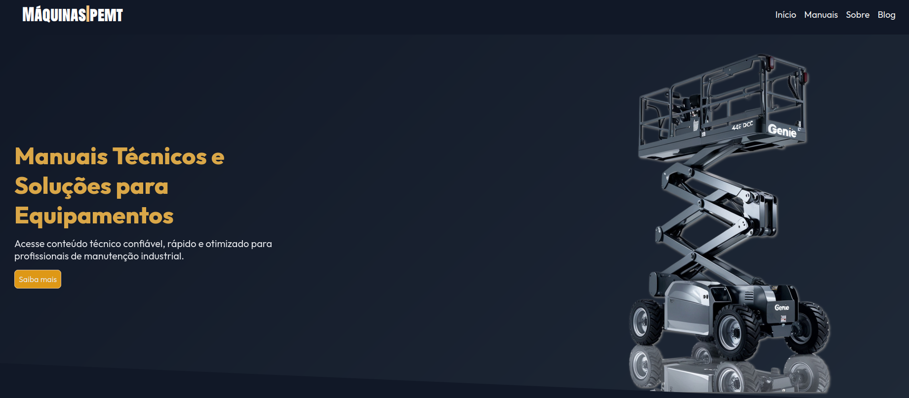
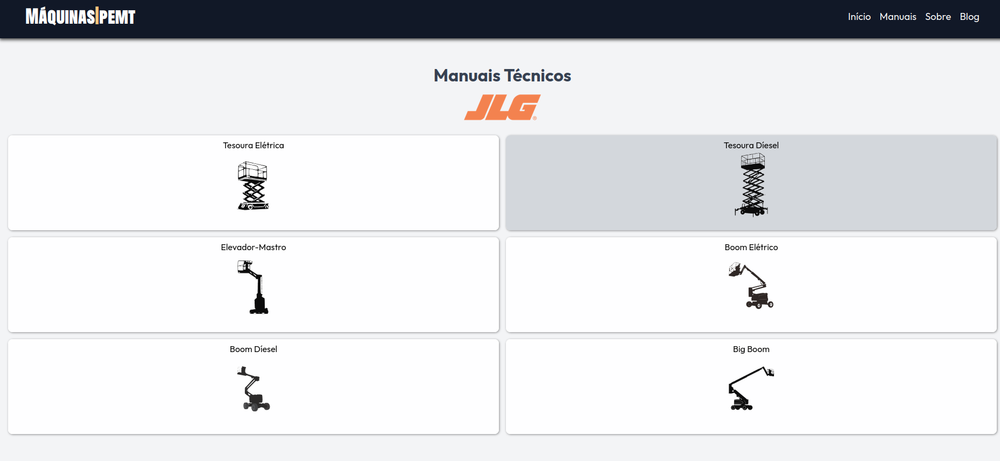
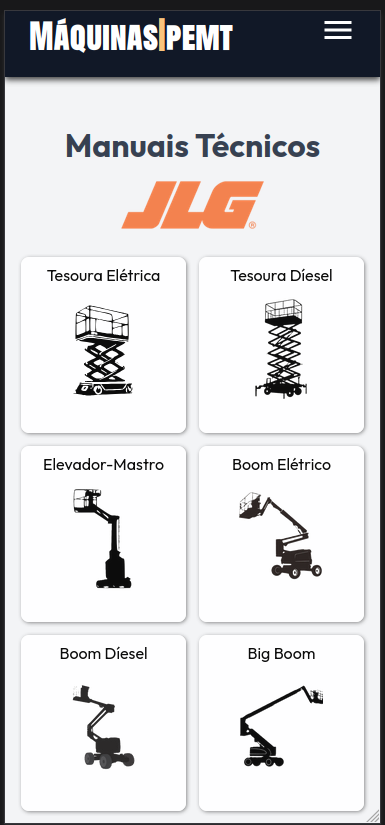

# 🛠️ Máquinas PEMT | 📚 Manuais Técnicos JLG



## ✨ Visão Geral

**Máquinas PEMT** é um site desenvolvido com foco na **experiência do usuário** para facilitar o acesso a **manuais técnicos da JLG**. O projeto segue a abordagem **mobile-first**, otimizando o uso em celulares e tablets por profissionais de manutenção industrial que necessitam de acesso rápido e prático aos documentos técnicos durante o trabalho em campo.

## 🚀 Funcionalidades

- 📱 Interface responsiva (mobile-first)
- 📚 Listagem de manuais técnicos por equipamento
- 📥 Visualização de arquivos PDF via Cloudflare R2
- 🔎 Navegação intuitiva com **SwiperJS**
- ⚡ Acesso rápido e otimizado com foco na usabilidade

## 🧱 Tecnologias Utilizadas

| Tecnologia      | Descrição                                         |
|----------------|--------------------------------------------------|
|  | Estrutura do site |
|  | Estilização visual |
|  | Lógica e interatividade |
|  | Carrossel e navegação |
|  | Armazenamento dos PDFs |
|  | Gerenciamento do domínio |
|  | Deploy da aplicação |

## 🗂️ Estrutura dos Dados
Os manuais em PDF são armazenados em um bucket da Cloudflare R2 e organizados via um arquivo JSON, que gera dinamicamente os elementos no DOM. Isso permite flexibilidade e escalabilidade conforme novos manuais forem adicionados.

⚠️ Observação: no momento, a estrutura ainda está em repositório local, em fase de testes.

```json
[
  {
    "nome": "Manual 1930ES",
    "arquivo": "https://arquivos.maquinaspemt.com.br/JLG/eletric/scissor-lift/1930ES-A-3246ES/operation/manual-de-operacao_ES-3122377_05-01-13_.pdf"
  },
  ...
]
``` 

## 📷 Capturas de Tela




## 📈 Melhorias Futuras
- 🔐 Área restrita para técnicos cadastrados
- 🧠 Implementação de IA para busca inteligente nos manuais
- 🗃️ Filtro por modelo, categoria ou tipo de falha
- 🌎 Suporte multilíngue

## 🙋‍♂️ Desenvolvedor
Feito com dedicação por Jeferson. Em transição de carreira para o desenvolvimento web, com foco em Front-End e construção de produtos que resolvem problemas reais.

## 📡 Deploy
O site está publicado em produção com Vercel e pode ser acessado no seguinte domínio:

🌐 [Máquinas PEMT](https://maquinaspemt.com.br)

## 📬 Contato
- 📧 [Meu e-mail](mailto:jeferson.ifce@gmail.com)
- 📱 [LinkedIn](https://www.linkedin.com/in/jeferson-n-75663b145/)

## ⭐ Contribuição
Sinta-se livre para abrir issues, sugerir melhorias ou contribuir com o projeto. Todo apoio é bem-vindo!